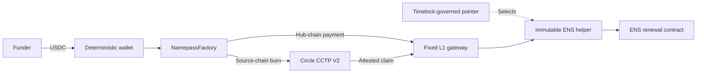

<div align="center">


# Namepass

Permissionless ENS renewal from deterministic USDC deposit wallets.


[Contracts](#contracts) · [Deployments](docs/DEPLOYMENTS.md) ·
[Development](CONTRIBUTING.md) · [Architecture](docs/ARCHITECTURE.md)

</div>

> Namepass is testnet-only and has not had an external contract audit. Do not send mainnet
> funds to the testnet deposit addresses. A mainnet ENS resolver does not enable mainnet renewals.

Namepass gives each normalized `.eth` name one deterministic deposit wallet across a supported
deployment set. Anyone can fund that wallet with the configured USDC. The funds buy renewal time
through ENS's price oracle. The website and hosted automation are optional: independent executors
can derive addresses, start renewals and complete Circle claims directly.


## How it works



1. Normalize the ENS name and derive its wallet. Contract calls use the label, such as `vitalik`,
   without the `.eth` suffix.
2. Send the configured USDC to that address on a supported testnet. Arc also accepts native USDC.
3. Anyone can call the factory to process the wallet balance. Hub-chain payments renew directly.
   Source-chain payments burn through Circle CCTP V2.
4. After Circle attests a burn, anyone can submit the message and attestation to
   `NamepassL1Gateway.completeCCTP` on the hub.

Successful settlement pays the executor a fixed 0.10 USDC allowance. A transfer larger than
Circle's per-message limit is processed in slices. Balances remain separate on each chain.

## Contracts

| Contract | Responsibility |
| --- | --- |
| [NamepassFactory](contracts/NamepassFactory.sol) | Derive wallets and start direct or cross-chain renewals |
| [NamepassL1Gateway](contracts/NamepassL1Gateway.sol) | Authenticate funding, complete CCTP claims and settle payments |
| [RenewalHelperPointer](contracts/RenewalHelperPointer.sol) | Select the active helper through the configured timelock |
| [ENSV2RenewalHelper](contracts/ENSV2RenewalHelper.sol) | Select the ENS renewal path and calculate exact duration |
| [NamepassResolver](contracts/NamepassResolver.sol) | Optional ENSIP-10 and CCIP-Read resolution |

The current release supports Ethereum Sepolia, Base Sepolia, Arbitrum Sepolia and Arc Testnet.
[Deployment records](docs/DEPLOYMENTS.md) contain current addresses, receipts and verification limits.

## Trust model

The factory is not an upgradeable proxy. Its initialized payment route is fixed. The gateway has
no owner, and each helper has immutable ENS addresses. The pointer's governance executor can
replace the helper after its timelock requirements are met. That replacement authority is a
trust assumption; interface validation alone cannot prove the behavior of replacement code.
The testnet timelock is wallet-controlled, not controlled by the ENS DAO.

The factory owner can change CCTP finality settings. A caller can supply a per-call CCTP fee
ceiling. Neither control provides an arbitrary payment destination. There is no owner sweep from
deposit wallets. The gateway can distribute only recorded earned residue to its fixed recipient.

Direct renewal is atomic. CCTP mint and renewal are also atomic: a failed renewal reverts the
claim, leaving the message available for retry. The protocol depends on ENS, USDC, Circle and the
configured contracts. Unsupported tokens sent to a wallet can be permanently unrecoverable.

## Pricing

The helper calculates the longest whole-second duration affordable after fees. It reads ENS's
current oracle, accounts for discount tiers and integer rounding, and checks its inverse quote
against ENS's forward price before renewal. It then checks the actual USDC charge. A mismatch
reverts settlement. Both migrated ENS V2 names and premigrated V1 reservations are supported.

The browser mirrors the arithmetic for display, but on-chain checks are authoritative. It does
not substitute default prices when oracle configuration is unavailable.


## Development

```sh
npm ci
npm run dev
```

Full-stack configuration, contract dependencies and relevant test commands are in
[CONTRIBUTING.md](CONTRIBUTING.md). The browser needs a configured API for live application data;
starting Vite alone does not provision the backend.

## Documentation

| Reference | Scope |
| --- | --- |
| [Architecture](docs/ARCHITECTURE.md) | Service boundaries, accounting and execution |
| [Contracts](docs/CONTRACTS_V2.md) | Contract interfaces, governance and ENS compatibility |
| [Deployments](docs/DEPLOYMENTS.md) | Current testnet addresses and verification evidence |
| [Web client](docs/FRONTEND.md) | Browser modules and data presentation |
| [Operations](docs/RUNBOOK.md) | Service configuration and incident recovery |
| [Monitoring](docs/MONITORING.md) | Metric definitions and authenticated dashboard |
| [Design rationale](docs/DECISIONS.md) | Key technical tradeoffs |
| [Engineering constraints](docs/ENGINEERING_CONSTRAINTS.md) | Payment, pricing and concurrency invariants |

## License

A project license has not yet been selected. Third-party notices remain with their respective files.
