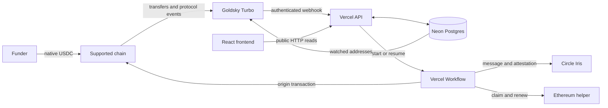

<div align="center">


# Namepass

Testnet infrastructure for permissionless ENS renewal with native USDC.


[Architecture](#system-architecture) · [Local development](#local-development) ·
[Operations](docs/RUNBOOK.md) · [Deployments](docs/DEPLOYMENTS.md)

</div>

Each ENS label maps to a deterministic CREATE2 deposit wallet. A funder sends USDC to that wallet.
Namepass then renews the ENS name on Ethereum at the current ENS price.

> [!WARNING]
> Namepass is testnet-only and has not completed an external contract audit. There is no mainnet
> deployment. Do not use this system with mainnet funds.


## Deployment status

| Layer | Current state |
|---|---|
| Contracts | Deployed and verified on Ethereum Sepolia, Base Sepolia, Arbitrum Sepolia, and Arc Testnet |
| Contract path | Direct Ethereum renewal and CCTP claims have been proven on chain |
| Database | Neon stable-testnet schema and runtime roles are deployed |
| API and workflows | Vercel stable-testnet API and Workflow environment are deployed |
| Indexer | The Goldsky `namepass-testnet` pipeline is running |
| Relayer | Configured for the stable-testnet automation path |
| End-to-end automation | Verified on stable testnet |
| Mainnet | Blocked by the audit, deployment, canary, recovery, and operations gates |

See [deployments](docs/DEPLOYMENTS.md) for contract addresses and chain evidence. See the
[operations runbook](docs/RUNBOOK.md) for managed-service resources and open gates.

## System architecture



### Service boundaries

| Component | Responsibility |
|---|---|
| Namepass contracts | Derive deposit wallets, move USDC, validate CCTP messages, and renew ENS names |
| Goldsky Turbo | Detect chain events and deliver ordered webhook records |
| Neon Postgres | Store names, canonical events, flows, transitions, nonces, and transaction intents |
| Vercel Functions | Validate HTTP requests, write application state, start workflows, and serve public reads |
| Vercel Workflow | Execute durable Ethereum and CCTP renewal sequences |
| Circle Iris | Return the final CCTP v2 message, nonce, and attestation |
| React frontend | Render public API read models and derive deterministic deposit addresses |

Neon is the application source of truth. Chain receipts and contract events remain authoritative
for balances, burns, claims, and renewals. The system does not use Redis, a separate queue, a
WebSocket service, or a second application database.

## Renewal paths

| Origin | Sequence |
|---|---|
| Ethereum | Validate deposit, check ENS and balance, submit `factory.renew`, verify renewal events, record settlement |
| Base, Arbitrum, or Arc | Validate deposit, check ENS and balance, submit `factory.renew`, verify burn, poll Iris, submit `helper.completeCCTP`, verify claim and renewal events, record settlement |

The origin transaction starts after the deposit receipt is validated. It does not wait for a
separate deposit-finality stage. Circle applies the required finality after the CCTP burn. Iris
polling owns that wait.

A stored transaction intent is the workflow resume boundary. A retry reuses prepared transaction
data or handles a recorded revert. It does not repeat a completed burn. An unclaimed CCTP flow
keeps the original Circle message and retries the same claim.

## Frontend surface

The React frontend reads public API models. It does not connect to Neon or hold a relayer key. ENS
pricing loads from the Sepolia oracle, and the simulator keeps all pricing arithmetic in `BigInt`.


## Supported environments

`src/lib/chains.ts` is the shared registry for the frontend, API, workflows, indexer generator, and
tests.

| Environment | Chains | Status |
|---|---|---|
| Stable testnet | Ethereum Sepolia, Base Sepolia, Arbitrum Sepolia, Arc Testnet | Active |
| Initial mainnet | Ethereum, Base, Arbitrum | Planned and disabled |

Arc uses native USDC as its gas token. A direct Arc payment can appear as transaction value without
an ERC-20 `Transfer` event. The indexer and workflow support both Arc representations.

The deposit address is identical on each chain in one deployment set. The balances are not shared.
Each chain balance must independently meet the configured trigger amount. Send only the native USDC
address listed in the chain registry. The contracts do not provide a token sweep.

## Repository layout

| Path | Purpose |
|---|---|
| `contracts/` | Solidity factory, renewal helper, and resolver |
| `test/` | Foundry contract tests and the required ENS v2 test sources |
| `src/` | React frontend, public API adapter, pricing, and shared chain registry |
| `routes/api/` | Nitro API, webhook, CCIP-Read, and cron route handlers |
| `server/` | Database access, ingestion, reads, chain operations, recovery, and transaction intents |
| `workflows/` | Durable Ethereum and CCTP workflow entry points and steps |
| `drizzle/` | PostgreSQL migrations and Drizzle metadata |
| `goldsky/` | Stable-testnet Turbo pipeline and its generator |
| `scripts/` | Repository consistency checks |
| `docs/` | Architecture, deployments, operations, frontend details, and decisions |

Nitro owns server routing. Keep API routes in `routes/api/`. Do not add a root `api/` directory or a
catch-all Vercel rewrite. Either change can shadow or duplicate the generated Nitro routes.

## Local development

### Requirements

- Node.js and npm
- Foundry for contract work
- Vercel CLI and a development Postgres branch for API or workflow work
- Goldsky CLI for pipeline operations

Install dependencies:

```bash
npm install
cp .env.example .env.local
```

Run the frontend only:

```bash
npm run dev
```

Use `vercel dev` when the task requires Nitro API routes or Vercel Workflow. Link only to a
development or preview environment.

Build and preview the production output:

```bash
npm run build
npm run preview
```

### Database setup

Use a pooled URL for application traffic. Use a direct URL for migrations.

```bash
npx tsx server/db/migrate.ts
```

For an isolated preview database only:

```bash
VERCEL_ENV=preview npx tsx server/db/preview-fixtures.ts
```

The fixture command rejects `VERCEL_ENV=production`. Do not run it against a shared environment.

## Configuration

Copy `.env.example` and supply values outside the repository.

| Variable group | Purpose |
|---|---|
| `DATABASE_URL` | Pooled application connection |
| `DATABASE_URL_UNPOOLED` | Direct migration connection |
| `*_RPC_URL` | Server RPC endpoint for each active chain |
| `RELAYER_PRIVATE_KEY` | Test-only transaction signer |
| `RELAYER_ADDRESS` | Public relayer address; must match the private key |
| `RELAYER_TRANSACTION_UNIT_WEI_*` | Per-chain relayer gas health thresholds |
| `GOLDSKY_WEBHOOK_SECRET` | Authenticates Goldsky delivery |
| `CRON_SECRET` | Authenticates recovery, health, and retention routes |
| `CIRCLE_IRIS_URL` | Circle Iris base URL for the active environment |
| `DEPLOYMENT_ENVIRONMENT` | Public environment label used by the service |
| `VITE_SEPOLIA_RPC` | Public browser RPC used for ENS pricing reads |
| `VITE_API_BASE_URL` | Optional public API origin; blank means same origin |

Never put a secret in a `VITE_*` variable. Browser variables are public. Keep mainnet, stable
testnet, preview, and local credentials separate.

## API and scheduled operations

Vercel schedules these operations from `vercel.json`:

| Route | Schedule | Purpose |
|---|---|---|
| `/api/cron/recover` | Every minute | Resume safe work and reconcile stale flow ownership |
| `/api/cron/health` | Every 5 minutes | Check the database, RPC chain IDs, and relayer gas |
| `/api/cron/retention` | Daily at 03:17 UTC | Remove expired raw payloads in bounded batches |

The [operations runbook](docs/RUNBOOK.md) defines the endpoint contract, rate limits, recovery
drills, and alert rules.

## Verification

There is no CI workflow. Run the applicable checks locally before each pull request.

```bash
npm run build
npm run check:server
npm run test:frontend
npm run test:server
npm run test:workflow
node scripts/check-chains.mjs
node goldsky/generate-testnet.mjs --check
npx drizzle-kit check --config drizzle.config.ts
forge test
```

`npm run build` does not compile Solidity. Use `forge build` or `forge test` for contracts.

## Deployment and operations

Do not deploy from this README. Use the runbook and record the environment-specific evidence.

- Apply database migrations before code that requires the new schema.
- Deploy Vercel before a Goldsky pipeline targets a new stable endpoint.
- Validate the generated Goldsky pipeline before `apply`.
- Keep Goldsky pointed at a stable domain, not an immutable preview URL.
- Confirm the health and recovery routes after each deployment.
- Fund the relayer with native gas on every active chain before test funding starts.
- Do not change `ACTIVE_ENVIRONMENT` or `MAINNET_LAUNCH_APPROVED` without the Phase 8 evidence.

See [docs/RUNBOOK.md](docs/RUNBOOK.md) for release order, roles, secrets, alerts, and recovery.

## Security constraints

- The contracts are testnet-only and not externally audited.
- Normalize each ENS label before deriving or registering its deposit address.
- Verify the RPC chain ID before simulation, signing, or broadcast.
- Store signed transaction bytes before broadcast.
- Verify receipt status, emitter addresses, route fields, amounts, and expected events.
- Never mark a flow settled from a transaction hash alone.
- Keep the relayer key exclusive to this service.
- Keep database, webhook, cron, and relayer secrets out of the browser and repository.
- Show deposit addresses in full in any payment interface.

Mainnet remains disabled until the independent audit, reviewed deployment, canaries, recovery
drills, alert review, and operations gates are complete.

## Documentation

| Document | Scope |
|---|---|
| [CLAUDE.md](CLAUDE.md) | Repository rules and load-bearing implementation constraints |
| [PRODUCT.md](PRODUCT.md) | Product scope and current product decisions |
| [docs/ARCHITECTURE.md](docs/ARCHITECTURE.md) | Contracts, data model, workflows, service boundaries, and launch plan |
| [docs/DEPLOYMENTS.md](docs/DEPLOYMENTS.md) | Testnet addresses and on-chain evidence |
| [docs/FRONTEND.md](docs/FRONTEND.md) | Frontend read model, state, components, and invariants |
| [docs/RUNBOOK.md](docs/RUNBOOK.md) | Environment setup, releases, recovery, monitoring, and mainnet gates |
| [docs/DECISIONS.md](docs/DECISIONS.md) | Dated architecture and product decisions |

## License

No license file is present. All rights are reserved by default.
