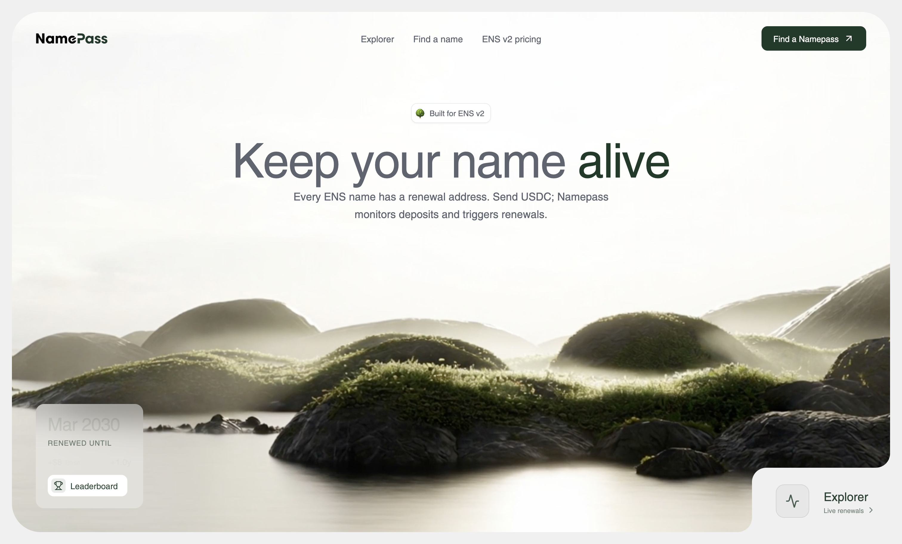
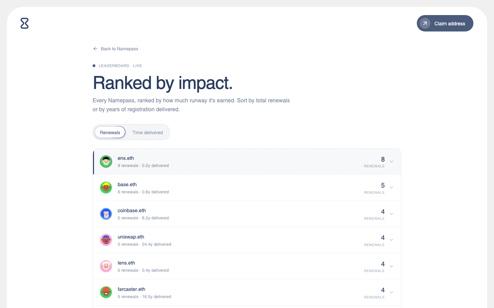
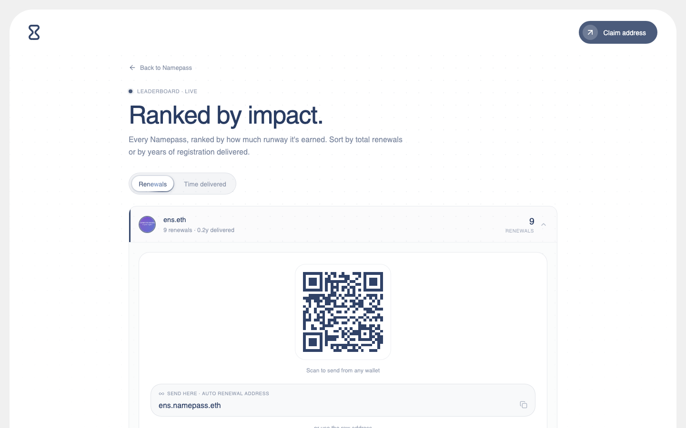
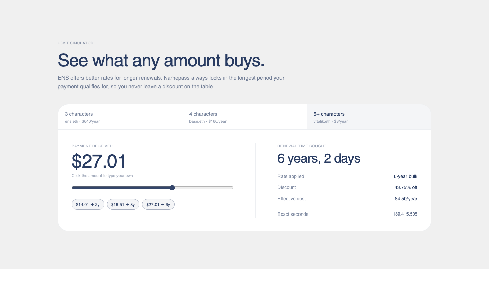
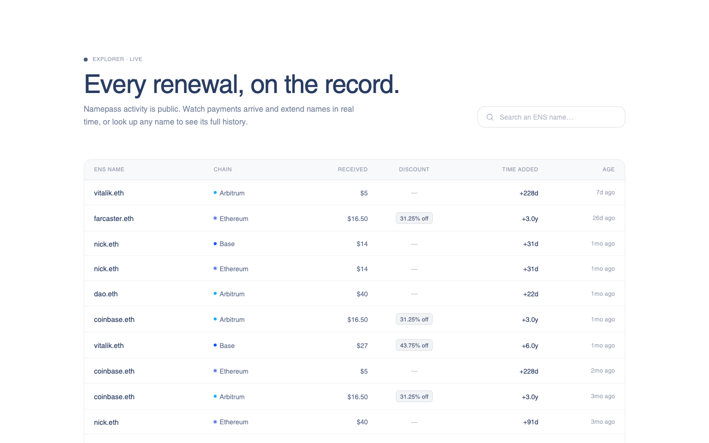

<div align="center">


# Namepass

**Every ENS name gets its own renewal address.**
Send USDC from any chain, the name gets more time — automatically, at the best rate available.

[](https://react.dev)
[](https://www.typescriptlang.org)
[](https://vite.dev)
[](https://tailwindcss.com)
[](https://motion.dev)
[](https://ens.domains)
[](#-a-note-on-what-this-is)



</div>

<br />

<details>
<summary><strong>📋 Table of contents</strong></summary>

- [What it does](#-what-it-does)
- [A note on what this is](#-a-note-on-what-this-is)
- [Feature tour](#-feature-tour)
- [Tech stack](#-tech-stack)
- [Getting started](#-getting-started)
- [Project structure](#-project-structure)
- [Under the hood](#-under-the-hood)
- [License](#license)

</details>

## 🪪 What it does

Every ENS name expires. Namepass gives it a **permanent, chain-agnostic deposit address** —
anyone can send USDC to it, from Base, Arbitrum, Arc, or Ethereum, and it's converted into
renewal time at the exact on-chain rate — no markup on the ENS price, just a flat $0.10 gas
allowance per renewal toward the mainnet fees Namepass fronts. Ownership isn't required to fund
one: a name's biggest supporter can keep it alive without ever holding the keys.

Each address is derived deterministically with CREATE2 — it exists before anyone claims it, anyone
can verify it offline, and no custodian holds keys. Under the hood, a webhook detects inbound
payments, [Circle's CCTP](https://developers.circle.com/cctp) moves the USDC to Ethereum, and the
renewal executes in the same transaction that completes the transfer — no manual intervention.

The paragraph above describes the design. Only the on-chain part is built, and only on testnet.
Read the next section before you treat any of it as a running system.

## 🎬 A note on what this is

This repository has three parts. Each part is at a different stage. Do not give them one status.

**1. The contracts are built. They run on testnet only.**

`contracts/` is deployed to four test networks: Ethereum Sepolia, Base Sepolia, Arbitrum Sepolia,
and Arc Testnet. The full on-chain path has been run against the deployed ENS and Circle contracts.
The path is: deposit, CCTP burn on an L2, attestation, then one transaction that mints and renews
together. [`docs/DEPLOYMENTS.md`](docs/DEPLOYMENTS.md) lists the addresses and the transaction
hashes. 61 Foundry tests cover the contracts, and several review passes examined them. **No
external audit has been done. There is no mainnet deployment.**

**2. The automation backend does not exist.**

No service watches a deposit address. No deposit starts a renewal by itself.
[`docs/ARCHITECTURE.md`](docs/ARCHITECTURE.md) specifies the webhook, the database, and the worker.
None of them are built. The `renew(label)` function is permissionless, so any person can push a
deposit through the path manually. The testnet flows above were run this way.

**3. The app in this repository is a frontend prototype.**

The app points at the same test networks. The UI, the pricing math, and the interaction model are
exact (see [Under the hood](#-under-the-hood)). The activity, the balances, and the ENS ecosystem
statistics are simulated in the browser. The app does not read them from an indexer or from the
deployed contracts.

Treat the app as a prototype. It is not a production financial product.

The **addresses, prices and expiry dates are real**, though. Every address the app shows is derived
from the deployed factory's own CREATE2 rule — the same value `predictWallet(string)` returns on
chain, checked against all four networks. Every rate is read from ENS's rent oracle when the page
loads. And each name's expiry and whether ENS will renew it come from ENS's registry per name. So
the address on a card is genuine, the price beside it is ENS's, and the expiry is the real one —
the renewal *history* shown under it is not.

## ✨ Feature tour

| | |
|---|---|
| 🏠 **Hero + live renewal ticker** | The bottom-left card cycles real inbound-payment math — chain, amount, discount tier, and the resulting expiry — computed from the actual pricing oracle, not hardcoded copy. |
| 🧮 **Cost simulator** | Drag a slider or type any amount and watch it resolve into exact renewal time, live, for 3/4/5+ character names — including the "you're 1 dollar from a better rate" nudge. Every amount is a *send* amount carrying a bridging allowance, so the figure on the button clears its discount tier from any supported chain. |
| 📈 **Prices straight from ENS** | No rate table ships with the app. Base rates, discount tiers and the USDC conversion are read from the registrar's own oracle at load — the same values the renewal contract prices with. The read takes ~150ms and says nothing about itself: the hero paints immediately and the simulator shows skeletons exactly the size of the numbers they'll become. If it fails, the app says so rather than quoting a price from memory. |
| 📡 **Explorer** | A public, Etherscan-style live feed of every renewal across every name, plus a full per-name detail view: expiry runway, ENS profile (avatar, links, socials), and complete payment history. |
| 🏆 **Leaderboard** | Every Namepass ranked by renewals or time delivered, with inline-expandable rows (no page navigation) showing the QR code and deposit address on the spot, plus a jump straight to that name's activity. Time reads adaptively — days, months, then years and months — since names range from a week of runway to decades. |
| 🖼️ **ENS avatars everywhere** | Real ENS avatars via the [resolvio](https://api.resolvio.xyz) profile API, gracefully falling back to a deterministic [Dicebear](https://dicebear.com) avatar seeded by name. |
| 🔎 **Instant search** | Type a complete `.eth` name and it auto-searches after a debounce — no Enter required. No Namepass yet? Activate it inline, right there in the empty state. Names are validated with real [ENSIP-15 normalization](https://docs.ens.domains/ensip/15), not a regex, so emoji and non-Latin names work and names ENS can't hold are turned away *before* anyone sees an address for them. |
| 🔗 **Real deposit addresses** | The address on every card is the deployed factory's CREATE2 derivation, computed locally from the label — the same one `predictWallet("vitalik")` returns on Sepolia, Base Sepolia, Arbitrum Sepolia and Arc. No RPC, no spinner, and verifiable offline against the constants in [`src/lib/namepass.ts`](src/lib/namepass.ts). |
| 💰 **Pending balance** | Funds that have arrived but aren't renewal time yet, broken down **per chain** — because a CREATE2 address is the same everywhere but the balances are separate pots that can't be combined. Each chain carries its own reason for waiting, and its own retry for when a transfer got stuck. |
| 📡 **In-flight renewals** | A CCTP transfer takes 30 seconds to 26 minutes. The time depends on the origin chain; see the measurements in [`docs/ARCHITECTURE.md`](docs/ARCHITECTURE.md). The feed therefore shows a renewal while it runs, in three stages: burning, awaiting attestation, and renewing. The projected time shows as `~6.0y` until the renewal completes. |
| 🧾 **Renewal breakdown** | Expand any renewal to see where the money went — received, gas allowance, applied — and the two or three transactions behind it, each linked to the right block explorer for its chain. |
| 🛡️ **Supported tokens** | The exact USDC contract on each of the four networks, shown in full and linked to its block explorer, because "check the ticker" is how people lose money to bridged `USDC.e`. Deliberately a whitelist — match one of these four exactly or don't send — and honest that anything else sent to a deposit address can't be recovered. |
| 🧪 **Testnet strip** | A slim marquee above every page saying which networks this deployment actually watches. Not dismissible: "this is a testnet" isn't a notice someone should be able to close and then forget while looking at a deposit address. Pauses under `prefers-reduced-motion`. |
| 💎 **Shine & shimmer UI** | Hand-ported [Magic UI](https://magicui.design)–style primitives (`ShineBorder`, `AnimatedShinyText`, `NumberTicker`, `DotPattern`) restyled to a single navy accent — restrained, not confetti. |
| 🪟 **One consistent shell** | Every page — home, leaderboard, supported tokens, terms, privacy — renders inside the same rounded card with the same header, so navigating between them never feels like leaving the app. |

<div align="center">
<table>
<tr>
<td width="50%"></td>
<td width="50%"></td>
</tr>
<tr>
<td width="50%"></td>
<td width="50%"></td>
</tr>
</table>
</div>

## 🧱 Tech stack

| Layer | Choice |
|---|---|
| Framework | React 18 + TypeScript, bundled with Vite 6 |
| Styling | Tailwind CSS v4 (`@theme`, no config file) |
| Motion | [`motion`](https://motion.dev) (Framer Motion's successor) for every transition, layout animation, and gesture |
| Icons | [lucide-react](https://lucide.dev) |
| ENS data | [resolvio](https://api.resolvio.xyz) profile API — cached and deduplicated across components |
| Chain reads | A ~180-line batched `eth_call` client over `fetch` (`lib/rpc.ts`). No web3 library: the app reads four `view` functions once at boot and never signs anything, so a wallet SDK would be several hundred kilobytes of surface area for nothing |
| ENS names | [`@adraffy/ens-normalize`](https://github.com/adraffy/ens-normalize.js) for ENSIP-15, and [`@noble/hashes`](https://github.com/paulmillr/noble-hashes) for the keccak-256 behind the CREATE2 derivation — the only two runtime dependencies that touch money |
| Contracts (deployed, testnet) | Solidity 0.8.24 · Foundry · CREATE2 via the Safe Singleton Factory · Circle CCTP v2 · ENS v2 renewers |
| Automation (specified, unbuilt) | Goldsky Turbo Pipelines · Vercel Functions · Vercel Workflows · Neon Postgres. See [`docs/ARCHITECTURE.md`](docs/ARCHITECTURE.md) |
| Routing | ~40 lines of hand-rolled `history.pushState` — no router dependency for five pages |

## 🚀 Getting started

```bash
git clone git@github.com:stevegachau/namepass-v2.git namepass
cd namepass
npm install
npm run dev
```

```bash
npm run build     # tsc --noEmit && vite build
npm run preview   # serve the production build locally
```

## 📁 Project structure

```
src/
├── components/
│   ├── magicui/            ShineBorder, AnimatedShinyText, NumberTicker, DotPattern
│   ├── Hero.tsx            Home hero content (badge, headline, CTA cards)
│   ├── Navbar.tsx          Shared header — logo, glass menu, CTA
│   ├── PageShell.tsx       The rounded card every page renders inside
│   ├── Explorer.tsx        Live feed (settled + in-flight) + per-name detail view
│   ├── Leaderboard.tsx     Ranked list with inline-expandable rows
│   ├── Simulator.tsx       Cost simulator
│   ├── PassCard.tsx        QR + deposit address + supported chains + contract check
│   ├── PendingBalance.tsx  Per-chain funds waiting, with why and a manual retry
│   ├── Tooltip.tsx         Shared info bubble — portaled, so accordions can't clip it
│   ├── ChainTag.tsx        Chain name + brand-coloured live dot
│   ├── SupportedTokens.tsx Native USDC contract per chain, in full, with explorer links
│   └── Footer.tsx / Terms.tsx / Privacy.tsx
├── lib/
│   ├── pricing.ts          Exact ENS v2 StandardRentPriceOracle math, BigInt end to end
│   ├── oracle.ts           ENS's live rates, read from the registrar's oracle at boot
│   ├── ensName.ts          Per-name expiry + renewability, from ENS's registry and renewers
│   ├── rpc.ts              Minimal batched eth_call client — reads only, never writes
│   ├── namepass.ts         ENS label → deposit address, the deployed factory's CREATE2 rule
│   ├── registry.ts         Seeded mock names + the flow simulation (see note above)
│   ├── tokens.ts           Real testnet USDC addresses — not mock
│   ├── fees.ts             The flat $0.10 gas allowance taken per flow
│   ├── ens.ts              resolvio profile client
│   ├── qr.ts               QR matrix encoder
│   └── format.ts           Date/currency/duration formatting
└── App.tsx                 ~165 lines of state + routing tying it together

contracts/                  Solidity. Testnet only. Not audited.
├── NamepassFactory.sol     CREATE2 deposit wallets and the CCTP burn. Also the ERC-1167 impl.
└── ENSV2RenewalHelper.sol  Ethereum side. Claims the CCTP message and renews in one transaction.

test/                       61 Foundry tests. Pricing runs against ENS's own oracle.
```

The npm scripts do not build the contracts. Use Foundry:

```bash
forge build
forge test
```

## 🔬 Under the hood

A few decisions worth knowing about before you touch the code. For the full picture there are five
docs, each with a distinct job:

| Doc | Covers |
|---|---|
| [`CLAUDE.md`](CLAUDE.md) | Working conventions and the load-bearing constraints, in brief |
| [`docs/FRONTEND.md`](docs/FRONTEND.md) | **How the app that exists works** — data layer, domain model, simulation, state, invariants |
| [`docs/ARCHITECTURE.md`](docs/ARCHITECTURE.md) | The contracts (built, testnet) and the backend (specified, unbuilt). CREATE2 addresses, CCTP, Postgres schema |
| [`docs/DEPLOYMENTS.md`](docs/DEPLOYMENTS.md) | **Live testnet addresses** and what has been proven on chain |
| [`PRODUCT.md`](PRODUCT.md) · [`docs/DECISIONS.md`](docs/DECISIONS.md) | What/why, and a dated log of non-obvious calls |

<details>
<summary><strong>Pricing math is exact, not approximate</strong></summary>

<br />

`src/lib/pricing.ts` mirrors ENS v2's `StandardRentPriceOracle` for 5+ character names, in
`BigInt` end to end. `divCeil` matches the contract's `Math.Rounding.Ceil`, so every number
shown matches on-chain to the micro-unit.

| Duration | Threshold | Discount |
|---|---|---|
| 1 year | `$8.000021` | — |
| 2 years | `$14.000037` | 12.5% off |
| 3 years | `$16.500044` | 31.25% off |
| 6 years | `$27.000071` | 43.75% off |

Thresholds aren't round numbers — the 3-year rate starts at exactly `$16.500044`, so a payment
of `$16.50` falls **44 micro-units short** and silently drops to the previous tier.
`ceilToCent()` rounds every threshold up to the next payable cent so the UI's quick-select
buttons never suggest an amount that under-shoots.

</details>

<details>
<summary><strong>Deposit addresses are never truncated</strong></summary>

<br />

The Namepass deposit address is always shown **in full**. Truncation hides the middle of an
address — exactly where an address-swap attack would land — so a sender can't verify what
they're actually paying. The ENS profile's *resolved* address is still truncated, since it's
informational rather than a payment target.

</details>

<details>
<summary><strong>The header lives inside the page, not above it</strong></summary>

<br />

`PageShell` renders the same rounded card (video background on Home, white elsewhere) with
`Navbar` as its first child on every route. That's what makes switching between Home,
Leaderboard, Terms, and Privacy feel like one app instead of four stitched-together pages.

</details>

## License

No license file yet — all rights reserved by default. Ask before reusing.

