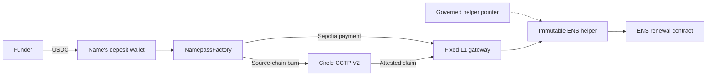

<div align="center">


# Namepass

USDC-funded ENS renewals from deterministic deposit wallets.


[How it works](#how-it-works) · [Contracts](#contract-boundaries) ·
[Current deployment](docs/DEPLOYMENTS.md) · [Development](CONTRIBUTING.md)

</div>

> [!WARNING]
> Namepass is deployed on testnets only. Its contracts have not had an external audit.
> Do not send mainnet funds to a testnet deposit address.

Namepass lets anyone fund an ENS name without owning it. Each normalized `.eth` name maps to a
deterministic wallet address within a deployment set. A funder sends the configured USDC to that
address. Any executor can then convert the balance into ENS renewal time at the on-chain price.
The contracts do not require the Namepass website or hosted automation.

The **September 22, 2026 testnet deployment** replaced an earlier factory and reset application
data. Its deposit addresses differ from the previous deployment. Always derive an address from the
[current factory](docs/DEPLOYMENTS.md) before funding it.


## How it works



1. Normalize the ENS name and derive its wallet. Contract calls use the label, such as `vitalik`,
   without `.eth`.
2. Send the configured USDC to that wallet on a supported testnet. Arc Testnet also accepts its
   native USDC through the wallet.
3. Anyone can call `NamepassFactory.renew` to process the wallet balance. Ethereum Sepolia payments
   go directly to the gateway. Payments on the other supported chains burn through Circle CCTP V2.
4. After Circle attests a burn, anyone can submit its message and attestation to
   `NamepassL1Gateway.completeCCTP` on Sepolia. The gateway selects the active ENS helper and
   settles the renewal.

The executor receives a fixed **0.10 USDC allowance** on successful settlement. Circle's actual
fee, when applicable, also comes from the processed amount. Balances remain separate by chain.
A payment above Circle's per-message burn limit is processed in slices.

The deposit card shows the full wallet address and a QR code for that address. It also shows a
`<label>.namepass.eth` convenience name. The current release record does not yet verify the
wildcard resolver deployment or parent-record update, so use the full address for funding.

## Contract boundaries

| Contract | Role |
| --- | --- |
| [NamepassFactory](contracts/NamepassFactory.sol) | Derives wallets and starts direct or cross-chain payments |
| [NamepassL1Gateway](contracts/NamepassL1Gateway.sol) | Authenticates funding, completes CCTP claims, and settles payments |
| [RenewalHelperPointer](contracts/RenewalHelperPointer.sol) | Selects the active helper through its governance executor |
| [ENSV2RenewalHelper](contracts/ENSV2RenewalHelper.sol) | Selects the ENS renewal path and calculates exact duration |
| [NamepassResolver](contracts/NamepassResolver.sol) | Provides optional ENSIP-10 and CCIP-Read resolution |

The factory is not an upgradeable proxy. Its initialized payment route is fixed. The gateway has
no owner and fixes its payment token, Circle contracts, factory, pointer, and residue recipient at
construction. Each ENS helper has immutable ENS contract addresses. The pointer can select a new
helper after its governance requirements are met. Interface checks cannot prove the behavior of
future helper code.

The **testnet timelock is wallet-controlled**. Mainnet is designed to use an ENS governance
executor, but no mainnet deployment has occurred. The factory owner can change CCTP finality
settings. A caller supplies a fee ceiling for one CCTP call. Neither setting changes the fixed
payment route. There is no owner sweep from deposit wallets. Unsupported tokens sent to a wallet
can be permanently lost.

Direct renewal is atomic. A CCTP claim mints and renews in one transaction. If settlement fails,
the claim reverts and the attested message can be submitted again. The route depends on ENS,
Circle, USDC, and the configured contracts. See [contract boundaries](docs/CONTRACTS_V2.md) and
[engineering constraints](docs/ENGINEERING_CONSTRAINTS.md) for the exact rules.

## Pricing and ENS compatibility

The helper reads the selected ENS renewer's current oracle. It calculates the longest whole-second
duration that the available USDC can buy after fees. It handles ENS discount tiers and integer
rounding, checks its inverse quote against ENS's forward quote, and checks the actual token charge.
A mismatch reverts settlement. The helper supports both migrated ENS V2 names and premigrated V1
reservations.

The browser mirrors this calculation for display. On-chain checks are authoritative, and the
browser does not substitute default prices when live configuration is unavailable.


## Current testnet status

The September 22 release uses one factory address on Ethereum Sepolia, Base Sepolia, Arbitrum
Sepolia, and Arc Testnet. The [deployment record](docs/DEPLOYMENTS.md) contains the addresses,
receipts, source verification, and limits of the available evidence. The hosted application was
cut over to this replacement deployment. The record includes a direct Sepolia renewal and native
Arc deposit and claim canaries. It does not claim a fresh automated canary on every source chain
after the reset. These results are not a security audit.

The website shows deposit addresses, indexed activity, and renewal progress. Goldsky observes
chain events, Neon stores application state, Vercel Functions serve public reads, and Vercel
Workflow runs hosted execution. Public activity is evidence from those services; chain receipts
remain authoritative. The [architecture](docs/ARCHITECTURE.md) describes these boundaries.

## Repository map

| Path | Purpose |
| --- | --- |
| `contracts/` and `test/` | Protocol contracts and Foundry tests, plus grouped application tests |
| `src/` | Browser application and public API adapters |
| `routes/api/`, `server/`, `workflows/` | HTTP routes, application logic, and durable execution |
| `drizzle/`, `goldsky/` | Database migrations and event pipeline definition |
| `tools/deployment-console/` | Wallet-signed testnet deployment and verification console |
| `docs/` | Current contract, deployment, architecture, and operations references |

The deployment console is separate from the public app. It remains in the repository because it
generates and verifies the current deployment's artifacts. Its generated output is ignored by Git.

## Develop and verify

Use Node.js 22, npm, and Foundry. Install dependencies and start the local frontend:

```sh
npm ci
npm run dev
```

The frontend needs a configured API for live data. Starting Vite does not provision the backend.
[CONTRIBUTING.md](CONTRIBUTING.md) has environment setup, the pinned Foundry dependency, and the
relevant build and test commands. CI runs the required checks on pull requests and pushes to
`main`.

## Documentation

- [Contract design](docs/CONTRACTS_V2.md) and [deployment evidence](docs/DEPLOYMENTS.md)
- [Architecture](docs/ARCHITECTURE.md) and [engineering constraints](docs/ENGINEERING_CONSTRAINTS.md)
- [Frontend](docs/FRONTEND.md), [operations](docs/RUNBOOK.md), and [monitoring](docs/MONITORING.md)
- [Dated decisions](docs/DECISIONS.md)

## License

A project license has not yet been selected. Third-party notices remain with their respective
files.
