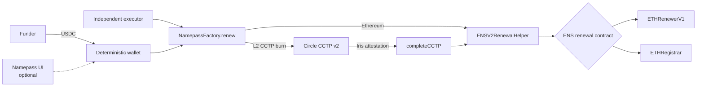

<div align="center">


# Namepass

Permissionless ENS renewal from deterministic USDC deposit wallets.


[How it works](#how-it-works) · [Trust model](#trust-model) ·
[ENS-v2](#ens-v2-ready) · [Pricing](#inverse-ens-price-calculation) ·
[Contracts](#contracts)

</div>

> [!WARNING]
> Namepass is testnet-only and has not had an external contract audit. There is no mainnet
> deployment. Do not send mainnet funds to the testnet addresses in this repository.


Namepass gives each normalized `.eth` label one deterministic deposit wallet. The wallet has the
same address on every chain in a deployment set. A funder sends native USDC to that address. The
funds can only follow the configured route to an ENS renewal on Ethereum.

The Namepass website is one client of the protocol. It shows addresses, activity, and renewal
progress. Its deposit card shows a copyable `<label>.namepass.eth` subdomain, the full deposit
address, and an address QR code. It also runs automation for users who do not want to submit transactions. The contracts
do not depend on that website or automation. A funder or an independent executor can derive a
wallet, start a renewal, and complete a CCTP claim directly.

## How it works



1. Normalize the ENS label and remove `.eth`. `vitalik` is valid input. `vitalik.eth` is not.
2. Call `NamepassFactory.predictWallet(label)` or use the same CREATE2 calculation locally.
3. Send the configured USDC token to that wallet on a supported chain.
4. Anyone can call `NamepassFactory.renew(label)` on the chain that holds the USDC.
5. On Ethereum, the factory transfers and renews in one transaction. On an L2, the factory burns
   USDC through CCTP v2. After Circle attests the burn, anyone can call
   `ENSV2RenewalHelper.completeCCTP(message, attestation)` on Ethereum.

The executor pays transaction gas. A successful renewal pays the executor a fixed `$0.10` USDC
allowance. This incentive applies to the direct Ethereum path and the CCTP completion path.

If a deposit is larger than Circle's live per-message burn limit, the factory processes one slice.
Later permissionless calls process the remainder. The factory reads the limit from Circle. A
Namepass operator does not set it.

## Trust model

The contracts constrain what Namepass operators can do. The main property is narrow and
verifiable:

> [!IMPORTANT]
> No Namepass admin function can redirect USDC from a deterministic deposit wallet to an arbitrary
> recipient.

### Fixed after deployment or initialization

| Property | Contract rule |
|---|---|
| Deposit wallet | CREATE2 derives it from the normalized label, factory address, and fixed wallet bytecode |
| Wallet runtime | Each wallet is a storage-free ERC-1167 proxy that permanently delegates to the factory |
| Factory code | The deployed factory is not an upgradeable proxy |
| USDC token | Initialization sets it once |
| Circle messenger | Initialization sets it once on L2s |
| Ethereum helper destination | Initialization sets it once |
| Executor allowance | The helper fixes it at `$0.10` in contract code |
| Deposit recovery | There is no owner sweep or arbitrary token recovery path |

The Ethereum transfer and renewal are atomic. The CCTP mint and renewal are also atomic. If the
renewal fails, the full transaction reverts. An attested CCTP message remains unclaimed and can be
submitted again.

### Mutable controls

| Control | Authority | Limit |
|---|---|---|
| CCTP finality threshold | Factory owner | Changes the Circle timing tier. It cannot change the recipient or fee ceiling. A bad value can impair L2 execution. |
| Maximum CCTP fee | Caller of `renewWithFee` | Applies to one call. Circle receives its actual fee. No owner can store a fee ceiling. |
| ENS renewal contracts | ENS governance executor | Updates both ENS v2 renewal pointers during migration. Mainnet is designed to use the ENS DAO Timelock. |
| ENS referrer | Helper owner | Changes attribution only. It cannot change the price or payment destination. |
| Helper residue | Helper owner | Can withdraw only USDC at rest in the helper. The atomic flow keeps pending user funds out of the helper. |

This design still depends on Circle, USDC, ENS, and the configured contracts. The current Sepolia
helper uses a Namepass address as the governance executor because Sepolia has no ENS DAO Timelock.
That placeholder is testnet-only and does not prove the planned mainnet governance boundary. The
contracts have not had an external audit, so this README does not make an absolute “unruggable”
claim.

Sending another token to a deposit wallet does not create a recovery right. The protocol can only
process its configured USDC token. Other tokens can be permanently lost.

## ENS v2 ready

ENS v2 has two renewable name populations during migration. The helper asks ENS which renewal
contract accepts the label on every renewal.

| Name state | ENS contract |
|---|---|
| Native or migrated ENS v2 name | `ETHRegistrar` |
| Premigrated ENS v1 reservation | `ETHRenewerV1` |

The helper does not infer migration state off chain. It calls `isRenewable(label)` and then reads
the price oracle from the selected ENS renewal contract. ENS governance can update the two renewal
pointers as the migration changes. It can retire the v1 path by setting that pointer to zero.

Both paths have completed verified renewals on Sepolia. See the transaction evidence in
[docs/DEPLOYMENTS.md](docs/DEPLOYMENTS.md#proven-on-chain).

## Inverse ENS price calculation

ENS normally calculates a token price for a requested duration. Namepass starts with a USDC
balance and calculates the longest whole-second duration that the balance can buy.

For ENS payment-token ratio `numerator / denominator`:

```text
ENS forward price = ceil(standard price × numerator / denominator)
Namepass budget   = floor(USDC available × denominator / numerator)
```

The helper then walks the ENS discount tiers from the longest and best tier to the shortest tier.
For each tier, it solves the exact inverse of ENS's rounded duration formula. It uses the current
base rate for the label length, the current discount points, and the current USDC ratio from the
selected ENS oracle.

Before it approves USDC, the helper checks that its inverse quote equals the selected ENS renewal
contract's forward quote. After renewal, it checks that the actual USDC balance change equals that
same amount. A mismatch reverts the transaction.

```text
Namepass inverse quote = ENS forward quote = USDC actually charged
```

`quote(label, usdcAvailable)` returns the maximum duration and exact cost. `usdcAvailable` must be
the send amount minus the fixed `$0.10` executor allowance. The frontend mirrors this calculation
for immediate feedback, but the contract performs the authoritative checks on chain.


## Contracts

| Contract | Role | Source |
|---|---|---|
| `NamepassFactory` | Derives wallets and starts direct or CCTP renewals | [contracts/NamepassFactory.sol](contracts/NamepassFactory.sol) |
| `ENSV2RenewalHelper` | Selects the ENS renewal path, prices duration, validates CCTP, and settles renewal | [contracts/ENSV2RenewalHelper.sol](contracts/ENSV2RenewalHelper.sol) |
| `NamepassResolver` | Optional ENSIP-10 and CCIP-Read interface for `*.namepass.eth` | [contracts/NamepassResolver.sol](contracts/NamepassResolver.sol) |

### Stable testnet deployment

| Contract | Address | Chains |
|---|---|---|
| `NamepassFactory` | `0xe0b155Fdb1104824d7E0568aeAFCC52823EDD00F` | Ethereum Sepolia, Base Sepolia, Arbitrum Sepolia, Arc Testnet |
| `ENSV2RenewalHelper` | `0xf1b51552098ffa7dc2cd83d0fb6508e57db8acc1` | Ethereum Sepolia |

The factory has the same address and bytecode on all four chains. A label therefore derives the
same deposit address on all four chains. Balances remain separate on each chain.

The stable-testnet automation has completed verified end-to-end renewals. Direct Ethereum renewal,
both ENS v2 name states, and CCTP claims from all three supported L2 testnets have also been proven
on chain. This evidence is not an audit.

See [docs/DEPLOYMENTS.md](docs/DEPLOYMENTS.md) for USDC addresses, Circle domains, ENS contracts,
read-back values, and transaction evidence.

## Build and verify

```bash
npm install
npm run build
forge test
```

The full frontend, server, workflow, chain-registry, and contract verification commands are in
[CLAUDE.md](CLAUDE.md#commands).

## Documentation

| Document | Scope |
|---|---|
| [docs/ARCHITECTURE.md](docs/ARCHITECTURE.md) | Contract invariants, automation, data model, and launch plan |
| [docs/DEPLOYMENTS.md](docs/DEPLOYMENTS.md) | Testnet addresses and on-chain evidence |
| [docs/FRONTEND.md](docs/FRONTEND.md) | Optional web client, read model, and interface invariants |
| [docs/RUNBOOK.md](docs/RUNBOOK.md) | Service deployment, recovery, and monitoring |
| [docs/DECISIONS.md](docs/DECISIONS.md) | Dated architecture and product decisions |

## License

No license file is present. All rights are reserved by default.
