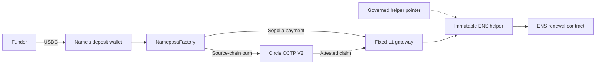

# Namepass

USDC-funded ENS renewals from universal deposit wallets.

[How it works](#how-it-works) · [Contracts and trust](#contracts-and-trust) ·
[Pricing](#exact-ens-pricing) · [Deployment evidence](docs/DEPLOYMENTS.md)

> [!WARNING]
> Namepass is deployed on testnets only. Its contracts have not had an external audit.
> Do not send mainnet funds to a testnet deposit address.

Namepass lets anyone fund an ENS name without owning it. Each normalized `.eth` label maps to a
universal deposit wallet within one deployment set. A funder sends the configured USDC to that
wallet. Any executor can then convert its balance into renewal time at ENS's on-chain price.
The payment route is permissionless: it does not depend on the Namepass website or its automation.

The **September 22, 2026 testnet deployment** replaced an earlier factory. Its deposit addresses
differ from the previous deployment. Derive addresses from the
[current factory](docs/DEPLOYMENTS.md) before funding them.

## How it works

1. Normalize the ENS name. Call `NamepassFactory.predictWallet(label)` with the label, such as
   `vitalik`, without `.eth`. CREATE2 derives the same wallet address on each chain in the current
   deployment set.
2. Send the configured USDC to that wallet on a supported testnet. Arc Testnet also accepts its
   native USDC through the wallet.
3. Anyone can call `NamepassFactory.renew` to process the wallet balance. Ethereum Sepolia payments
   go directly to the gateway. Payments on the other supported chains burn through Circle CCTP V2.
4. After Circle attests a burn, anyone can submit its message and attestation to
   `NamepassL1Gateway.completeCCTP` on Sepolia. The gateway selects the active ENS helper and
   settles the renewal.

The executor receives a fixed **0.10 USDC allowance** on successful settlement. Circle's actual
fee, when applicable, also comes from the processed amount. Balances remain separate by chain.
A payment above Circle's per-message burn limit is processed in slices.

The deposit wallet is an ERC-1167 proxy derived from the factory. It has no private key to hold or
recover. The full wallet address is the funding target. Optional `<label>.namepass.eth` resolution
is separate from payment execution.

## Contracts and trust

| Contract | Role |
| --- | --- |
| [NamepassFactory](contracts/NamepassFactory.sol) | Derives wallets and starts direct or cross-chain payments |
| [NamepassL1Gateway](contracts/NamepassL1Gateway.sol) | Authenticates funding, completes CCTP claims, and settles payments |
| [RenewalHelperPointer](contracts/RenewalHelperPointer.sol) | Selects the active helper through its governance executor |
| [ENSV2RenewalHelper](contracts/ENSV2RenewalHelper.sol) | Selects the ENS renewal path and calculates exact duration |
| [NamepassResolver](contracts/NamepassResolver.sol) | Provides optional ENSIP-10 and CCIP-Read resolution |

### Verified testnet deployments

Sourcify shows matching deployed bytecode and source for the current September 22 contracts:

| Contract | Network | Verified source |
| --- | --- | --- |
| NamepassFactory | Ethereum Sepolia | [Sourcify](https://repo.sourcify.dev/11155111/0x2dCB5CA6b21372b43e37C35Da8D5D15160423150) |
| NamepassFactory | Base Sepolia | [Sourcify](https://repo.sourcify.dev/84532/0x2dCB5CA6b21372b43e37C35Da8D5D15160423150) |
| NamepassFactory | Arbitrum Sepolia | [Sourcify](https://repo.sourcify.dev/421614/0x2dCB5CA6b21372b43e37C35Da8D5D15160423150) |
| NamepassFactory | Arc Testnet | [Sourcify](https://repo.sourcify.dev/5042002/0x2dCB5CA6b21372b43e37C35Da8D5D15160423150) |
| NamepassL1Gateway | Ethereum Sepolia | [Sourcify](https://repo.sourcify.dev/11155111/0x39351C9f9eAb6093eFB4e865a6330ECd2a756F0f) |
| RenewalHelperPointer | Ethereum Sepolia | [Sourcify](https://repo.sourcify.dev/11155111/0x774f942194d612e126A05Ce40a3A4D88AfBB6ae6) |
| ENSV2RenewalHelper | Ethereum Sepolia | [Sourcify](https://repo.sourcify.dev/11155111/0x7Bfee7c257ff48f8D787A61F15925e24743C8F88) |

These links show source matches, not a security audit. The current release record does not include
a verified NamepassResolver deployment. See the [source-verification record](docs/deployments/2026-09-22/source-verification.json)
for the underlying checks.

The factory is not an upgradeable proxy. Its initialized payment route is fixed. The gateway has
no owner and fixes its payment token, Circle contracts, factory, pointer, and residue recipient at
construction. Each ENS helper has immutable ENS contract addresses. There is no owner sweep from
deposit wallets.

The pointer's governance executor can activate a new helper after its timelock requirements are
met. Interface checks cannot prove what future helper code will do. The **testnet timelock is
wallet-controlled**. Mainnet is designed to use an ENS governance executor, but no mainnet
deployment has occurred. The factory owner can change CCTP finality settings. A caller supplies a
fee ceiling for one CCTP call. Neither setting changes the fixed factory payment route.
Unsupported tokens sent to a wallet can be permanently lost.

Direct renewal is atomic. A CCTP claim mints and renews in one transaction. If settlement fails,
the claim reverts and the attested message can be submitted again. The route depends on ENS,
Circle, USDC, and the configured contracts. See [contract boundaries](docs/CONTRACTS_V2.md) and
[engineering constraints](docs/ENGINEERING_CONSTRAINTS.md) for the exact rules.

## Exact ENS pricing

The helper reads the selected ENS renewer's current oracle. It calculates the longest whole-second
duration that the available USDC can buy after fees. It handles ENS discount tiers and integer
rounding, checks its inverse quote against ENS's forward quote, and checks the actual token charge.
A mismatch reverts settlement. The helper supports both migrated ENS V2 names and premigrated V1
reservations.

The helper performs these checks on-chain. A displayed estimate does not replace the selected
ENS contract's price at execution.

## Current testnet status

The September 22 release uses one factory address on Ethereum Sepolia, Base Sepolia, Arbitrum
Sepolia, and Arc Testnet. The [deployment record](docs/DEPLOYMENTS.md) contains the addresses,
receipts, source verification, and limits of the available evidence. It records a direct Sepolia
renewal and native Arc deposit and claim canaries. It does not claim a fresh automated canary on
every source chain after the reset. The wildcard resolver deployment and parent-record update are
also unverified in that record. None of this evidence is a security audit.

For the protocol's full contract rules, see [contract design](docs/CONTRACTS_V2.md) and
[engineering constraints](docs/ENGINEERING_CONSTRAINTS.md). For local setup and tests, see
[CONTRIBUTING.md](CONTRIBUTING.md).

## License

Namepass is licensed under the [MIT License](LICENSE). Third-party notices remain with their
respective files.
