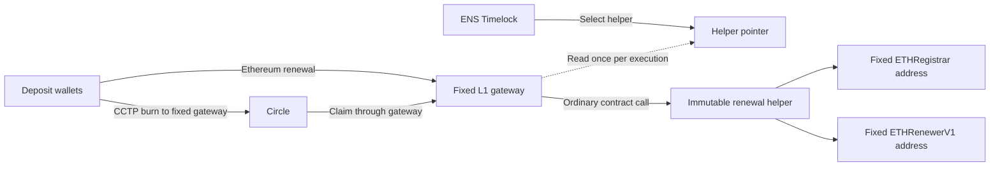

# Contract overhaul plan

Date: 2026-09-18. Status: replacement contracts deployed and initialized; independent chain
checks passed. Sourcify source verification passed for all eight deployments. All eight direct/CCTP canaries and the in-flight helper replacement rehearsal passed on
2026-09-19. Helper A is restored. Replacement services remain pending; explorer forwarding
has separate service limits.
The user selected a complete testnet data reset.

The wallet-driven in-flight replacement rehearsal is prepared in section 05 of the deployment
console. It uses an identical helper B, an Arc transfer for `steve.eth`, and a timed restoration
of helper A. All eight transactions were independently verified on 2026-09-19. See `tools/deployment-console/README.md` for its steps and
independent receipt verifier. Live evidence is in `docs/deployments/2026-09-18/helper-rehearsal-verification.json`.

The current implementation is described in `docs/CONTRACTS_V2.md`. Existing names, watched
addresses, balances, flows, activity, and transaction-intent records will be cleared at cutover.
Do not build a legacy data migration or keep both address generations in the application.
The reset procedure is in `docs/TESTNET_RESET.md`.

## Objective and sequence

Replace mutable ENS contract addresses inside the helper with an ENS-governed pointer to an
immutable helper deployment. Design and test the contracts first. Deploy and prove the contracts
on testnet next. Then update the application, services, indexer, and stored deployment records.

This plan separates confirmed repository facts from proposed design choices. The new ENS ABIs
were inspected on Etherscan. Source comparison and pinned Sepolia fork tests now cover both renewal paths. Actual new
CCTP burns, testnet deployment, contract review, and the system cutover remain release gates.

## Confirmed breaking change

The supplied Sepolia contracts are:

| Contract | Address and source |
|---|---|
| `ETHRegistrar` | [0xAbe76F6C8DFcEd81AA5A2bB8034202A7136b94ca](https://sepolia.etherscan.io/address/0xabe76f6c8dfced81aa5a2bb8034202a7136b94ca#code) |
| `ETHRenewerV1` | [0xd06e726e9bd8ac0f33a2a45f4cc28fe10d656a36](https://sepolia.etherscan.io/address/0xd06e726e9bd8ac0f33a2a45f4cc28fe10d656a36#code) |

Both expose `renew((string,uint64,bytes32),address)`. The tuple contains `label`, `duration`,
and `referrer`. The payment token is the second argument. Both also expose `renewBatch`.

The current `IETHRenewer` and `_settle` call in `contracts/ENSV2RenewalHelper.sol` use
`renew(string,uint64,address,bytes32)`. The function selector is different. Calling `setRenewers`
with the new addresses does not repair this incompatibility.

The new ABIs still expose `isRenewable(string)`, `rentPriceOracle()`, and
`getRenewPrice(string,uint64,address)`. Their presence does not prove unchanged behavior or
unchanged oracle math. The published `NameRenewed` event has the fields used by our current
decoder. Confirm event behavior with receipts before reusing that decoder.

The registrar page reports a verified similar match and a constructor warning. Do not infer
constructor values from the matching contract. Read the actual deployment values on chain.

## Proposed contract boundary

Use three L1 contracts. Keep the pointer limited to configuration. Put the permanent payment
endpoint in a separate gateway.

These contracts are deployed on testnet. Independent receipt, runtime, and configuration checks
passed on 2026-09-18. See `DEPLOYMENTS.md`. All eight direct/CCTP canaries passed on 2026-09-19.
The in-flight helper replacement test also passed. System cutover remains pending.

| Contract | Responsibility | Mutable authority |
|---|---|---|
| `NamepassFactory` | Derive wallets; start direct renewals or CCTP burns | Keep current post-initialization limits |
| `RenewalHelperPointer` | Return the active helper; record changes | ENS Timelock only |
| `NamepassL1Gateway` | Authenticate wallet and CCTP funds; call the selected helper; settle accounting | No helper setter or arbitrary execution owned by Namepass |
| `ENSV2RenewalHelper` | Select the ENS path; quote duration; approve and call ENS | No renewer setter, upgrade path, or owner |

### Pointer

- Expose `currentHelper()` and `setHelper(address)`.
- Permit `setHelper` only from the configured ENS governance executor. On mainnet this must be
  the actual ENS Timelock, not the Governor. Verify the executor at deployment time.
- Emit the previous and new helper addresses on each change. Record the helper runtime code hash
  in the release manifest and preferably in the change event.
- Reject a zero address, an address without code, and incompatible helper configuration. Validate
  the interface version, gateway, factory, and payment token before activation.
- Treat interface checks as error prevention. They cannot prove that arbitrary helper code is safe.
- Support a timelock-controlled executor migration. Specify a two-step handover in the design.
  Give Namepass no emergency override. Do not add a second time delay unless the threat model
  requires it; the ENS Timelock supplies the governance delay.
- Permit an initial inactive state before the first helper is selected. Only the Timelock can
  activate it. The gateway must reject execution while the pointer is inactive.

### Fixed gateway

A getter-only pointer is insufficient for CCTP. The source burn fixes `mintRecipient` and
`destinationCaller` in the message. Both must refer to the permanent gateway, not a helper version.
The top-level CCTP recipient remains Circle's destination TokenMessenger.

- Preserve `factory()` and `renewFromWallet(string,uint256,address)` if possible. These methods
  allow a new deployment of the current factory bytecode to use the gateway as its fixed helper.
- Move `completeCCTP` and its route, label, wallet, attestation, nonce, fee, and mint-delta checks
  into the gateway. Check the message version, destination domain, and address encoding too.
- Read the pointer once for each execution. Use that same helper throughout the transaction.
- Use ordinary calls. Do not use `delegatecall` to load a helper implementation into gateway storage.
- Keep the executor allowance fixed at `100_000` USDC base units for this deployment generation.
  Pay the original executor exactly once, only after settlement succeeds.
- Bound the helper's allowance to this call's renewal budget. Clear it after settlement. Never
  approve the gateway's complete balance or leave an allowance for a retired helper.
- Require the helper to return unused budget. Check balance deltas and the settlement result.
  Keep pre-existing gateway and helper balances outside the current payment's accounting.
- Keep wallet funding and renewal atomic. Keep CCTP minting and renewal atomic. A failure must
  leave wallet funds in the wallet or the same CCTP message unclaimed.
- Add a reentrancy guard around fund-moving entrypoints. Do not add a generic call or sweep method.
- Emit canonical `CCTPClaimed` and `Renewed` events from the gateway. Preserve the current event
  ordering used to associate claims, ENS renewals, and settlement. Record which helper executed
  the renewal through an additional event or explicitly versioned event schema.
- Specify rounding-residue handling before deployment. Recommended: track earned residue
  separately and permit withdrawal only of that recorded amount. Never classify the entire token
  balance as withdrawable residue. Fix the recipient or define the limited authority explicitly.

### Immutable helper

- Set the gateway, factory, USDC, `ETHRegistrar`, `ETHRenewerV1`, and referrer at construction.
  Use public Solidity `immutable` values where applicable. This fixes the addresses in deployed
  runtime code without requiring one source file for every network.
- Remove `setRenewers`, helper governance, ownership, and owner-controlled withdrawal methods.
- Accept funded execution only from the gateway. Quotes can remain public.
- Use the new `RenewData` tuple. Do not add batch renewal solely because ENS now supports it.
- Select the renewer on chain for each label. Read the selected renewer's current oracle.
- Preserve exact inverse pricing, the ENS forward-price check, and the actual-charge check.
- Approve only the amount ENS must charge. Clear that allowance after use. Return rounding
  residue to the gateway in the same call.
- Define a stable Namepass-facing quote, eligibility, metadata, and execution interface. Future
  helpers absorb ENS ABI changes behind this interface. Put ENS-specific expiry decoding here
  where practical, so backend code does not depend on registry internals.
- Permit a zero V1 renewer only if retirement is part of the reviewed interface. Retiring V1 then
  requires a new helper and a pointer change.

### Trust and scope limits

ENS governance will be able to replace renewal logic, not only ENS addresses. This is a broader
authority over routed funds. An immutable helper does not make the whole system immutable.
Balance checks cannot prove that a malicious replacement actually bought ENS renewal time.
The mainnet trust statement must explicitly include this authority.

This design isolates ENS integration changes. It does not make the frozen factory, USDC address,
Circle contracts, CCTP format, or gateway interface replaceable. A breaking change at those
boundaries can still require another deployment generation. Freeze that boundary deliberately.

## Ordered work and release gates

### 1. Record the compatibility baseline and reset scope

1. Save both new ABIs, verified source references, runtime code hashes, and a fixed Sepolia block.
2. Compare all helper dependencies, including renewal eligibility, grace periods, minimum duration,
   oracle interfaces, price rounding, token ratio, registry expiry reads, and event order.
3. Read each new renewer's registry and oracle from the actual deployed address. Verify native
   USDC support. Do not assume the previous shared oracle or registry still applies.
4. Choose live test labels for native/migrated names and premigrated V1 reservations.
5. Record the services, workflow runs, transaction senders, and indexer checkpoints that must be
   stopped before the reset. Account for already signed or submitted transactions before clearing
   their records, so an old transaction cannot conflict with the new relayer nonce queue.
6. Clear the current data at the later cutover. Do not migrate old names, flows, activity, or saved
   deposit addresses into the new deployment.

**Gate:** reviewed ABI and behavior comparison, plus a complete reset checklist. Do not point the
old helper directly at the incompatible new ENS contracts.

### 2. Freeze the contract design

1. Specify pointer authorization, initial activation, executor handover, and helper compatibility.
2. Specify the helper interface, exact fund flow, allowance cleanup, event ownership, fee, referrer,
   residue policy, and failure behavior.
3. Confirm whether the current factory bytecode can be reused with the gateway. Prefer reuse if
   its interface and invariants remain valid.
4. Review the governance trust change and permanent gateway assumptions.
5. Use the user-authorized clean reset. Define the service shutdown, deletion, and restart order.
   On-chain contracts and transfers cannot be erased by an application reset.

**Gate:** review the implemented specification in `docs/CONTRACTS_V2.md`. The implementation uses
three L1 contracts and a fixed residue recipient. Only recorded earned residue is withdrawable.

### 3. Implement and test contracts

1. Implement the pointer and gateway. Refactor the helper into the immutable ENS adapter.
2. Update ENS test sources to the verified version. Retain real ENS oracle tests; mocks alone
   cannot validate the price calculation.
3. Test native V2, migrated V2, premigrated V1, grace, expired, unavailable, and V1-retired states.
4. Test unauthorized pointer changes, invalid helpers, executor handover, timelock scheduling,
   cancellation, execution delay, and change events.
5. Test exact pricing and allowance cleanup with tier boundaries, minimum budgets, Unicode labels,
   token ratios, and incompatible oracle configurations.
6. Test CCTP route rejection, replay, wrong wallet/label/domain, fees, mint mismatch, reentrancy,
   contaminated balances, and complete rollback when renewal fails.
7. Burn to the gateway while helper A is active. Activate helper B before the claim. Prove that
   the same message claims through B once. Also test rollback to A and a failed B claim followed
   by a successful retry after correction.
8. Prove that changing helpers changes neither predicted wallet addresses nor the CCTP destination.
9. Run pinned-block Sepolia fork tests against both supplied ENS deployments and the actual Circle
   path. Keep credential-free deterministic tests in CI; run live fork checks separately.

**Gate:** `forge build`, `forge test`, fork evidence, and a contract security review. Mainnet
requires an external audit and resolution of material findings.

### 4. Deploy and prove a new testnet generation

1. Freeze compiler settings, factory bytecode, constructor arguments, salt, and expected addresses
   in a deployment manifest. Use a new factory salt if the current bytecode is reused.
2. Deploy the same factory at the same new address on each supported testnet. Do not publish
   deposit addresses before initialization and verification are complete.
3. Deploy a Sepolia test Timelock with documented roles and a real delay. This exercises the
   governance mechanism; it does not establish ENS DAO control over testnet.
4. Deploy the pointer with that executor and no active helper.
5. Deploy the gateway with fixed factory, pointer, token, and Circle configuration.
6. Deploy the helper with the gateway and the supplied ENS contracts fixed at construction.
7. Verify source and runtime configuration. Schedule and execute the first pointer activation
   through the Timelock. Validate the complete configuration before activation.
8. Initialize every factory with its native USDC, its Circle messenger where required, and the
   same L1 gateway address. Verify every chain's values and wallet derivation independently.
9. Run a direct Sepolia renewal and a CCTP renewal from each of Base Sepolia, Arbitrum Sepolia,
   and Arc Testnet. Exercise both ENS name populations.
10. Repeat the helper-A-to-helper-B change with an actual in-flight CCTP transfer. Record source
    and destination receipts, final Circle nonce, expiry, allowances, and complete accounting.

**Gate:** verified deployment manifest and on-chain canary evidence. Only now start the application
and service migration against the proven contracts. Minimal deployment and canary scripts belong
to this phase; the production backend cutover does not.

### 5. Update the system to the deployed contracts

| Area | Required work |
|---|---|
| `src/lib/chains.ts`, `src/lib/namepass.ts` | Replace the current generation with the new factory, gateway, pointer, start blocks, and derivation fixtures |
| `src/lib/oracle.ts`, `src/lib/fees.ts` | Resolve the active helper; use its metadata and compatible quote model; read the fixed gateway allowance |
| `server/chain.ts` | Remove permanent assumptions about the two ENS addresses and `findExpiry(string)`; use the stable helper read interface |
| `server/ethereum.ts`, `server/cctp-renewal.ts`, `workflows/cctp.ts` | Submit to and validate the gateway; keep exact route, receipt, nonce, and transaction-intent identity |
| `server/goldsky.ts`, `server/ens-renewal.ts`, pipeline generation | Index gateway events, pointer changes, and ENS emitters for the new generation; discard old generation checkpoints |
| Database, activation, recovery, public API | Clear current records and start new activations, balances, flows, activity, and nonce state |
| Resolver and public funding views | Replace factory/address assumptions and publish only verified new addresses |

Read the pointer and related configuration at one block for each configuration snapshot. Do not
mix a pointer read from one block with helper metadata from another. Refresh configuration on
pointer changes and before transaction simulation. Handle reorgs and stale cache entries.

Keep a small static registry for the permanent gateway and pointer. Keep discovered helper
versions and ENS emitter ranges as validated, block-scoped data. A pointer change must not
silently require rebuilding the website. An unsupported pricing model must fail closed or use
the authoritative helper quote; it must not reuse stale client-side inverse math.

Do not assume both renewers always use one oracle. Either quote through the selected helper path
or explicitly reject unsupported split-oracle configuration. Retain the repository's no-fallback
pricing rule. Use pointer events and existing workflows for updates; do not add scheduled RPC
health polling.

Preserve exact origin-event and Circle-nonce identities within the new generation. A clean reset
removes the need for a legacy backfill or parallel address generations. Future helper changes
still need block-scoped helper and ENS emitter history within this new generation.

**Gate:** application build, server and workflow checks, frontend/server/workflow tests,
chain-registry check, and generated pipeline check. Prove replay, reorg, duplicate webhook,
external execution, and helper-change handling before activating automation.

### 6. Clear current data and switch service traffic

Follow `docs/TESTNET_RESET.md`. Stop old writers and workflow runs first. Clear every current
application record and watched address. Replace old indexer sources, checkpoints, and delivery
credentials so old events cannot recreate deleted rows. Publish the verified new contracts and
addresses. Start with empty activity and fresh name activation. Enable automation one source
chain at a time after a canary succeeds.

Do not migrate or backfill the old generation. Historical blockchain contracts and transfers
remain on chain. Resetting the application does not move old wallet balances or retarget messages.

**Gate:** old names, addresses, flows, and activity do not reappear. New canaries have matching
chain, database, API, and frontend evidence. Update all current deployment and trust documentation.

### 7. Standard procedure for later ENS changes

1. Build a new immutable helper against the new ENS contracts.
2. Verify its source, code hash, configuration, quote behavior, and settlement tests.
3. Exercise direct and in-flight CCTP cases on a fork and testnet.
4. Prepare emitter indexing and configuration discovery before activation.
5. Submit the exact pointer update for ENS governance. Schedule and execute it through the
   Timelock. Namepass cannot perform this step without ENS governance participation.
6. Verify the pointer event and run a canary. Retry existing unclaimed messages through the same
   gateway. Do not burn again for an already burned payment.

Rollback means another Timelock-controlled pointer update to a compatible helper. It is subject
to the governance delay. It cannot reverse a completed renewal or make a retired ENS contract
work. During failure, hold new automated burns and retain existing claims for retry. The permanent
gateway and published wallet addresses stay unchanged for compatible helper replacements.

## First implementation milestone

Complete phases 1 and 2, then deliver the contracts and tests in phase 3. Do not begin with an
address-only configuration patch. Do not deploy the replacement contracts before their gateway,
governance, accounting, and clean-reset rules are specified and tested.
